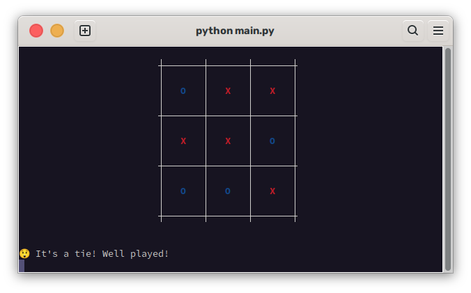
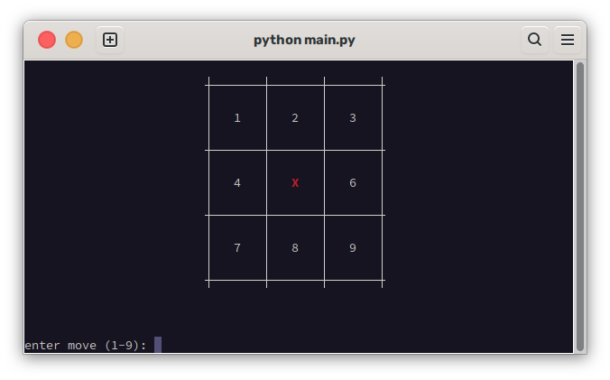

# TicTacToe
Python TicTacToe game against a bot  

## how to play
just download this repo, then run main.py.

## screenshots

## building
run ./build.sh  
note that this may not work on all systems. do not open an issue as i will not care.  
if it doesnt work, check out (pyinstaller)[https://pyinstaller.org/en/stable/]

## roadmap
add option to choose to start first  
add a two player mode (instead of just vs ai)
